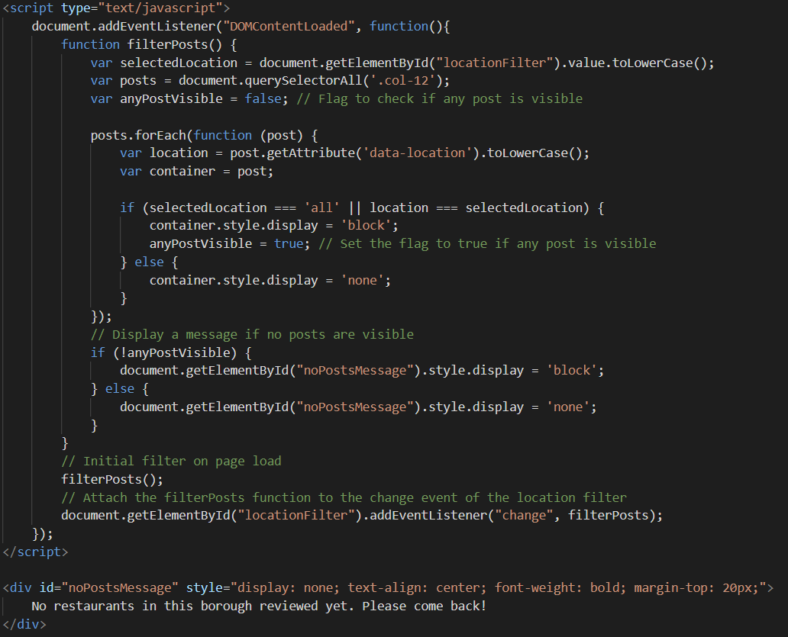
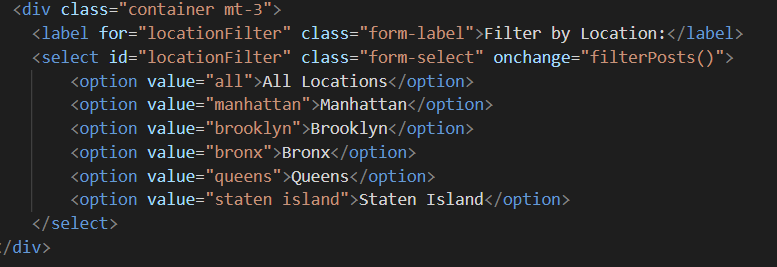
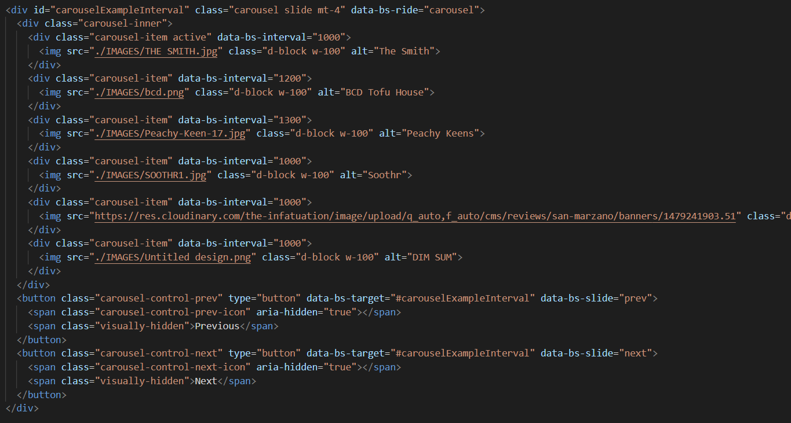

# Final Project
My Final Project is a continuation of my midterm project in which I added a slideshow, filter, fully finished blog post, 
and recreated some of the pages in order to make it look more appealing. 
Some of the tools that I used in order to make these changes were google maps API, bootstap, and javascript. As well as HTML and CSS. 

# What I learned!
- Completing this project I learned a few things, the first one being navigating boostrap. Boostrap was very helpful, but also can be confusing because is a lot of documentation/reading in order to make boostrap do what you want it to do. I learned about the different tags such as col-12 mb-4 border border-5 border-white p-3 bg-light which played a big role in formatting my blog post page. 
- Something else that I learned was using the google map API, if I had more time I would have explored more of that but it was very interesting to me how you could do so many things with the google map.

# Aspect of my Project that was Challenging
- There were a few aspects of the project that were challenging the main one was trying to figure out how to implement the filter in order to filter my blog post based on the Borough that it is from. So in the code snippet below, get the ID of location filter which is the name of the filter and then it will select all the blog post with the .col12, each block plost has a tag or attribute named data-location which is set to the location (borough) that the blog post is talking about. This then allows for the display to happen if that certain borough is clicked on, and if there is no blog post for that borough it will display a message. 

In addition something that was a bit challenging but also I did enjoy was using boostrap for the carousel in order to have it play automaically on the web page. The challenging part was finding pictures that fit the frame of the carousel. 

# Next Steps
- I did not have enough time to figure out how to add the blurb to the google map Pin when clicked on, so that is something that I would very much like to have done. The blurb would have the name of the resturant and the date/ time that "I would be attending" the restaurnat so that the people who read the blog post could join me. 
- Also fixing the submit button in my Resturant request since is not working, and also just having that sent to my personal email would be very cool
Small things that I would change
- overiding a lot of the styles for the buttons on bootstrap, and also adding some nice fonts that make the blog post look almost hand written

# Google Maps Page
- I wasn't sure how to hide my api key so here's a picuture on how my join me page looks like!

