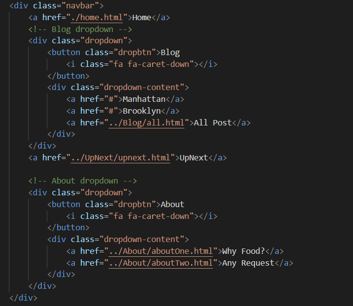

# Midterm Project:
 Creating a Restaurant Blog of places that I have been, that will go into detail about the restaurant, and have the location, and a link to go to the restaurant main website.

# Quick Layout Information
- Home: started page
- Blog: Broken down into boroughs
- Upnext: blog readers can see what restaurnts I will be going to next
- About Us: Why did I choose to write about food, and a form where people can submit places they want me to try.

# Code Snippet
The code below represents the html of my navigation bar. Here we can see how there are 4 different options but only two of them have dropdown options which are the "blog" button the About Us button

 

 # Next Steps
 - My next steps would be to continue working on my layout for the pages.
 - I need to complete the Manhathan and Brooklyn Page
 - I also want to add the slide show to the home page
 - Add different kind of fonts and having a full design layout 
 - Making it more fun with javascript!